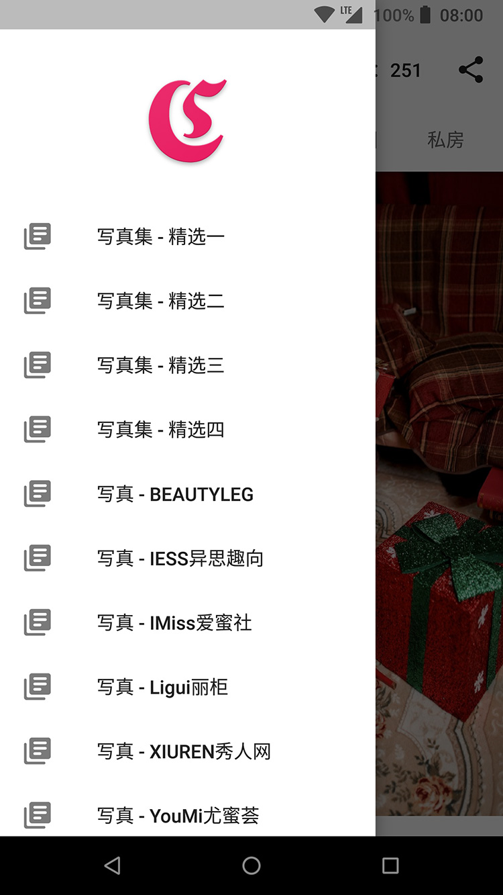

# 自由图

自由图是一个完全免费的软件，不会收集任何用户隐私信息。每位用户安装 app 后会有 20 个积分，每浏览一次套图消耗 1 个积分。

你可以通过两种方式获得积分：

1. 当总积分不足 10 个时，每分钟将增加 1 个积分，上限为 10 个积分；
2. 你可以点击 app 内任意一个位置的广告来获取 10 个积分。

注意：如果 app 首次打开时无法正常显示内容，请多尝试几次重启 app 或换个网络重新尝试，只要首次加载成功，之后不会在遇见这种问题了。

## 立即下载

最新版本下载地址：[下载](https://github.com/951120/ziyoutu/releases)

## 效果浏览

